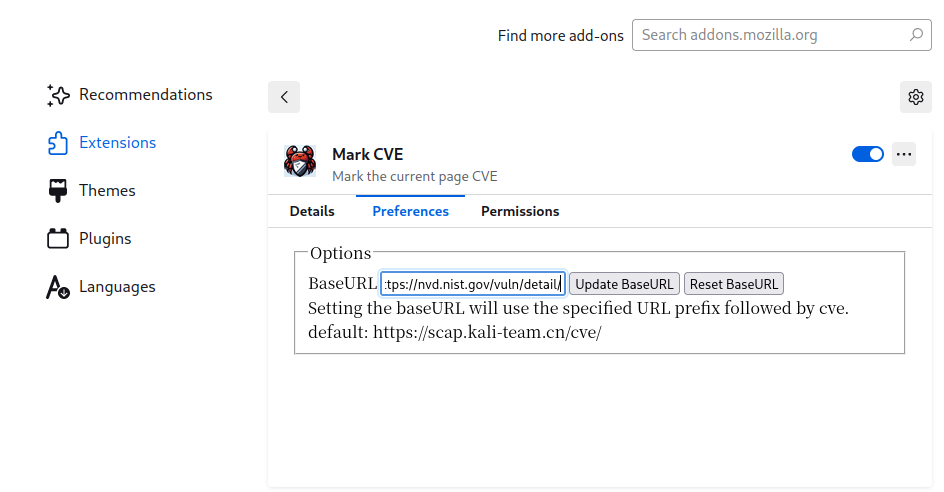
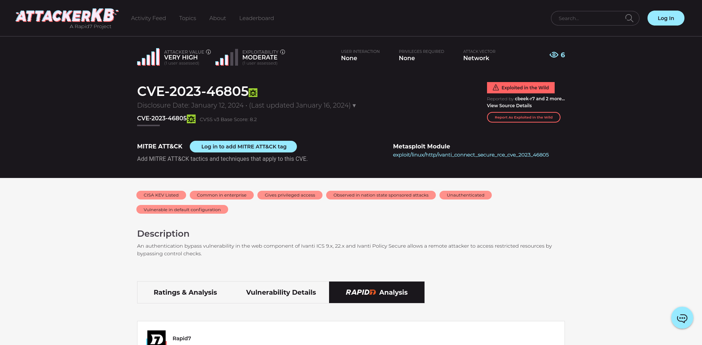

# Mark CVE
---
[![github]](https://github.com/emo-crab/scap-rs/tree/main/extensions)

[github]: https://img.shields.io/badge/github-8da0cb?style=for-the-badge&labelColor=555555&logo=github

- Mark the current page CVE.
- The original project https://github.com/emo-crab/scap-rs, Now as a project development.

## Option

- You can also set it as the official website,like: https://nvd.nist.gov/vuln/detail/

## Using

- Install the plugin, open a webpage with a CVE number, click on the plugin, and you will see a button added after the CVE.

## Bookmark JavaScript
- Create a bookmark, Edit the `URL` as the following `javascript:` [script](content-script.js).